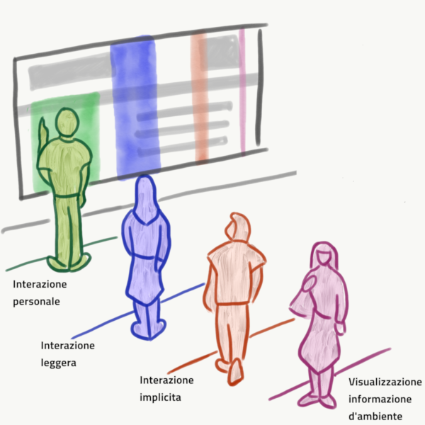

<header>
<h1>EmILIE </h1>

sEnsing ImpLicit Input and Emotions

</header>

The aim of the project is to coordinate a set of sensors of
consumer level, to support proxemic interaction
with the different devices, also determining the user's emotional condition. 
In this way, applications will opportunistically exploit the 
estimated values, increasing the device capabilities by sharing
information.

The project was funded by the [Sardinian Regional Government](https://www.regione.sardegna.it/) 
and by the [Fondazione di Sardegna](https://www.fondazionedisardegna.it/). It
ended in April 2019.

##Outline
1. [Project Results](#risultati)
2. [The Research Group](#gruppo) 
3. [Papers](#pubblicazioni)

##  Project Results

Every day we interact with a large number of devices scattered throughout the environment
that surrounds us, or that we wear and carry with us ([Figure 1](#figura1)).
Although each of them is connected independently to the internet,
allowing the communication with any service or application, these devices 
usually support the interaction with users in
an isolated way. This makes it difficult to create environments that take 
advantage of a fully multi-device interaction, even in situations where 
it would be advantageous, such as in shops, museums or classrooms.

*Figure 1: An example of an interactive multi-device environment.
 Different users can interact with different devices that are
 scattered within the environment. Each user can perform a task using 
 one or more devices, and/or collaborating with other users.*

The EmILIE project aims to study techniques for the
detection of information on the different entities in interactive environments,
coordinating and integrating data from different devices.
In particular, the project focused on _implicit_ input, i.e. on
pieces of information that we can collect about both users and 
the environment which were not generated with the aim of interacting with
a device, such as gestures, proxemics or positioning within the environment.
This type of information is important for planning and implementing
usable interactions on the different levels of interactivity, summarized in
[Figure 2](#figura2). 

Several pilot studies were completed within the project,
which allowed testing  
consumer-level devices like simple RGB cameras, depth sensors,
microphones, or Bluetooth devices for this type of detection.

*Figure 2: Different levels of interactivity based on the distance from the device.
 The first level supports a personal interaction with the device;
 the second supports a light interaction, which can also be shared between 
 multiple users;
 the third is the implicit interaction, in which the device can detect
 information without the user explicitly sending it;
 the fourth is the visualization of environmental information, useful 
 for the analysis of context in other interactions.*

The results of the project are divided into five threads of work.
The first is the ** proxemics and indoor location **.
We developed a hardware and software architecture for identifying 
the location of the user's position inside closed rooms,
using a classroom as an example scenario. The system works
through the use of two types of Bluetooth emitters (beacons), the first has a
long range and the second a short range. 
The first type, positioned on the walls, allows a position estimation by 
triangulation. 
The second allows identifying objects such as furniture or equipment that,
by themselves, do not support digital services.
We introduced an algorithm for combining the information
received by these emitters on a mobile device. We are able to
provide the position of the different pupils within the classroom and to 
provide the teacher with a view of the groups that emerged autonomously.
The functioning of the system is summarized in [Figure 3] (#figura3).

*Figure 3: Detection of a user's position within a room.
 Long range beacons allow estimating the absolute position by triangulation. 
 This information is supplemented by detection
 of short-range beacons that allow increasing the
 the accuracy of the positioning. A centralized server analyzes
 the position for all users in the environment and provides dynamic updates
  on groups that spontaneously emerged in the environment.*

A second thread of work is the development and application of
machine learning techniques for the ** recognition of user activities **,
taking advantage of the implicit input collected through different sensors.
During the course of the project, we developed several
techniques to solve basic problems in using data collected
during the analysis phase, as in the case of high dimensionality or in the case of one
strongly unbalanced class distributions. We studied and
implemented ensamble techniques to improve the stability and the 
effectiveness of detection. We evaluated the robustness of
different techniques for selecting attributes with respect to a perturbation
input data. These techniques, generally valid for different types
of data, have been applied in the project case study of activity recognition.
In particular, we experimented the personalization of the recognition of 
a whole set activities based on the characteristics and physical abilities 
of the user, for the personalising digital services based on the context 
of use, through the recognition of daily activities (such as walking,
running, washing etc.) and for customizing the definition
of the list of activities to be recognized within the interactive environments
(e.g. a smart home) based on user feedback, allowing a
simple integration of new sensors to refine activities
recognized.

The third thread of work is developing methods and techniques for the
** description and recognition of interactive gestures **.
This particular form of input allows obtaining important information
both when the movement is performed consciously and unconsciously. 
We developed a modeling technique based on the
composition of basic geometric elements (points, lines and arcs).
This allows developers to define interactive gestures as the 
temporal evolution of trajectories formed by these elements. 
The technique has a twofold advantage: on the one hand it allows the 
programmer to define gestures with a specific language, 
obtaining an accurate recognizer for both the entire gesture and its parts. 
On the other hand, the approach supports the user guidance during the 
execution of the gesture, by supporting partial recognition. 
This increases the usability of the gestural systems, since it facilitates 
the discovery and the execution of gestures, mitigating the problem of 
choosing an interaction vocabulary bounded to the recognition capability 
of the tracking devices.

The fourth thread of work was the ** extraction of knowledge from natural
language**. We proposed an algorithm that, starting with a small 
set of co-hyperonym words (such as Italy, France, Germany),
returns a longer list of items
(e.g., Spain, Portugal, Poland ...) in an unsupervised manner
(i.e. without the intervention of a human), simply by interpreting
automatically of the texts provided as input. This allows the extraction
of structured knowledge on a given domain or activity simply
by analyzing the descriptions in natural language. An evolution of this
system allows, in a semi-supervised mode, to answer independently
to users' questions in natural language, using 
automatically-learned knowledge. During the experimentation, the approach
has been applied to open data on the expenditure of governments of different countries,
obtaining encouraging results. A similar technique has been
also applied to the documentation and code of software libraries
(in Java language), creating a queryable ontology (CodeOntology)
for various purposes, such as software engineering or Computational question answering.

The fifth thread of work includes techniques for the ** demonstration of
ownership ** on the collected data , in order to make it easier to save and analyse data effectively. The results
in this line have led to the development of techniques to identify
analogies between the various pieces of information, so as to eliminate unnecessary duplication.
This allowed us to understand how different alternatives in
various evolutions can be compacted, introducing the concept of
merging relations, which has so far found application in Petri Nets. Finally, we focused on defining models for the
demonstration of formal properties related to correctness and completeness
of contracts for the use of data and the execution of services, which allows
proving properties to the service users.

##  The Research Group
The project was developed in the [Department of Mathematics and Computer Science, University of Cagliari, Italy.](https://dmi.unica.it/).
The research group includes the following professors:
* **Lucio Davide Spano.** Human Computer Interaction. Principal Investigator.
* **Barbara Pes.** Data Mining. Knowledge Extraction. 
* **Daniele Riboni.** Pervasive Computing. Proxemics and Activity Recognition.
* **Riccardo Scateni.** Computer Graphics. Geometry Processing. 
* **Giovanni Puglisi.** Computer Vision. Video and Image processing. 
* **Diego Reforgiato.** Sentiment Analysis. Emotion Recognition. 
* **Maurizio Atzori.** Semantic Web. Knowledge Representation and Natural Language Processing.
* **Massimo Bartoletti.** Security. Trustworthy Services . 
* **Michele Pinna.** Formal Methods. Parallel Computing.  

##  Project Publications
### 2019
* 	Alessandro Carcangiu, Lucio Davide Spano, Giorgio Fumera, Fabio Roli.
_DEICTIC: A compositional and declarative gesture description based on hidden markov models._ 
Int. J. Hum.-Comput. Stud. 122: 113-132 (2019).
* Alessandro Carcangiu, Lucio Davide Spano:
  _Integrating declarative models and HMMs for online gesture recognition._ 
  IUI Companion 2019: 87-88
* M. Bartoletti, B. Bellomy, L. Pompianu. A journey into Bitcoin metadata. 
In Journal of Grid Computing, 2019. 
[Paper](http://tcs.unica.it/journey-bitcoin-metadata.pdf?attredirects=0)
* M. Bartoletti, R. Zunino. Verifying liquidity of Bitcoin contracts. In 
  Proc. POST, 2019. [Paper](https://eprint.iacr.org/2018/1125)
* Roberto Cocco, Maurizio Atzori, Carlo Zaniolo. _Machine Learning of SPARQL Templates for 
Question Answering over LinkedSpending._ 28th IEEE International 
Conference on Enabling Technologies: Infrastructure for 
Collaborative Enterprises (IEEE WETICE 2019), DEW Track (DEW 2019) (2019)
* Barbara Pes. _Handling class imbalance in high-dimensional biomedical datasets._ 
28th IEEE International Conference on Enabling Technologies: 
Infrastructure for Collaborative Enterprises (WETICE 2019), June 12-14, 2019,
Capri (Napoli), Italy, to appear.
* Barbara Pes. _Ensemble feature selection for high-dimensional data: a 
stability analysis across multiple domains._ Neural Computing and 
Applications, 2019.
  [10.1007/s00521-019-04082-3](https://doi.org/10.1007/s00521-019-04082-3).
* Assunta Matassa, Daniele Riboni. _Reasoning with Smart Objects’ 
  Affordance for Personalized Behavior Monitoring in Pervasive Information 
  Systems._ Knowledge and Information Systems, Springer, 2019. To appear.
* Daniele Riboni, _Opportunistic Pervasive Computing: Adaptive Context 
Recognition and Interfaces._ 
CCF Transactions on Pervasive Computing and Interaction, Springer, 2019. 
[10.1007/s42486-018-00004-9](https://doi.org/10.1007/s42486-018-00004-9).

### 2018
* 	Fabio Marco Caputo, Pietro Prebianca, Alessandro Carcangiu, 
Lucio Davide Spano, Andrea Giachetti:
_Comparing 3D trajectories for simple mid-air gesture recognition._ 
Computers & Graphics 73: 17-25 (2018)
* 	Matteo Serpi, Alessandro Carcangiu, Alessio Murru, Lucio Davide Spano:
  _Web5VR: A Flexible Framework for Integrating Virtual Reality Input and 
  Output Devices on the Web._ PACMHCI 2: 4:1-4:19 (2018)
* 	Alessandro Carcangiu, Lucio Davide Spano:
  _G-Gene: A Gene Alignment Method for Online Partial Stroke Gestures Recognition._
  PACMHCI 2: 13:1-13:17 (2018)
* M. Bartoletti, B. Pes, S. Serusi. Data mining for detecting Bitcoin 
  Ponzi schemes. In Proc. Crypto Valley Conference on Blockchain 
  Technology, 2018
  [Paper](https://arxiv.org/abs/1803.00646)
* M. Bartoletti, T. Cimoli, L. Pompianu, S. Serusi. Blockchain for social 
  good: a quantitative analysis. Presented at Goodtechs, 2018
  [Paper](https://arxiv.org/abs/1811.03424)
* M. Bartoletti, T. Cimoli, R. Zunino. Fun with Bitcoin smart contracts. 
  In Proc. ISOLA, 2018.
  [Paper](https://eprint.iacr.org/2018/398.pdf)
* M. Bartoletti, L. Bocchi, M. Murgia. Progress-preserving Refinements of 
CTA. In Proc. CONCUR, 2018
[Paper](https://www.cs.kent.ac.uk/people/staff/lb514/catr.html)
* M. Bartoletti, R. Zunino. BitML: a calculus for Bitcoin smart contracts. 
  In Proc. ACM CCS, 2018. Also available as Cryptology ePrint Archive 
  2018/122, 2018
  [Paper](https://eprint.iacr.org/2018/122.pdf)
* N. Atzei, M. Bartoletti, S. Lande, R. Zunino. A formal model of Bitcoin 
  transactions. In Proc. Financial Cryptography, 2018
  [Paper](https://eprint.iacr.org/2017/1124.pdf)
* N. Atzei, M. Bartoletti, T. Cimoli, S. Lande, R. Zunino. SoK: unraveling 
  Bitcoin smart contracts. In Proc. POST, 2018. 
  [Paper](https://eprint.iacr.org/2018/192.pdf)
* Gabriele Civitarese, Claudio Bettini, Timo Sztyler, Daniele Riboni, 
  Heiner Stuckenschmidt, _NECTAR: Knowledge-based Collaborative Active 
  Learning for Activity Recognition._ In Proceedings of the 2018 IEEE 
  International Conference on Pervasive Computing and Communications 
  (PerCom), IEEE Computer Society, 2018.
* Barbara Pes. _Evaluating Feature Selection Robustness on High-Dimensional
 Data._ 13th International Conference on Hybrid Artificial Intelligence 
 Systems (HAIS 2018), Oviedo, Spain, June 20-22, 2018, LNCS, vol 10870, 
 pp 235-247, Springer.
 [10.1007/978-3-319-92639-1_20](https://doi.org/10.1007/978-3-319-92639-1_20).
* Carlo Zaniolo, Shi Gao, Maurizio Atzori, Muhao Chen, Jiaqi Gu. 
 _User-Friendly Temporal Queries on Historical Knowledge Bases_
  Information and Computation, Time 2015 special issue, Elsevier (2018)
* Maurizio Atzori, Simone Balloccu and Andrea Bellanti. _Unsupervised Singleton 
Expansion from Free Text._
ICSC 2018 - 10th IEEE International Conference on Semantic Computing (2018)

### 2017
* 	Martina Senis, Giovanni Atzori, Fabio Sorrentino, Lucio Davide Spano, Gianni Fenu:
  _Smart Furniture and Technologies for Supporting Distributed Learning Groups._ 
  CHItaly 2017: 11:1-11:6
* Fabio Sorrentino, Lucio Davide Spano, Sara Casti, Alessandro Carcangiu, 
Fabrizio Corda, Gianmarco Cherchi, Alessio Murru, Alessandro Muntoni, Stefano Nuvoli, 
Riccardo Scateni:
_ChIP: Teaching Coding in Primary Schools._ DCPD@CHItaly 2017: 106-110
* Giovanni Casu, G. Michele Pinna, _Merging Relations: A
  Way to Compact Petri Nets’ Behaviors Uniformly_, in Proceeding of LATA
  2017, Lecture Notes in Computer Science 10168, pp. 325–337, 2017.
* 	Fabio Marco Caputo, Pietro Prebianca, Alessandro Carcangiu, Lucio Davide Spano, Andrea Giachetti:
  _A 3 Cent Recognizer: Simple and Effective Retrieval and Classification of Mid-air Gestures from Single 3D Traces._ 
  Eurographics Italian Chapter Conference 2017: 9-15
* N. Atzei, M. Bartoletti, T. Cimoli. A survey of attacks on Ethereum 
  smart contracts (SoK). In Proc. POST, 2017
  [Paper](https://eprint.iacr.org/2016/1007)
* M. Bartoletti, A. Bracciali, S. Lande, L. Pompianu. A general framework 
  for blockchain analytics. In Proc. SERIAL, 2017
  [Paper](https://dl.acm.org/citation.cfm?id=3152831)
* Mattia Atzeni, Maurizio Atzori. _CodeOntology: RDF-ization of Source Code._  
ISWC 2017 - Proceedings of the 16th International Semantic Web Conference, 
Resource Track (2017)
* Atzeni Mattia, Maurizio Atzori. _CodeOntology: Querying Source Code in 
a Semantic Framework._ ISWC 2017 - Proceedings of the 16th International 
Semantic Web Conference, Demo Paper (2017)
* Maurizio Atzori, Ludovico Boratto, Lucio Davide Spano. _Towards Chatbots 
as Recommendation Interfaces._ 2nd Workshop on Engineering Computer-Human 
Interaction in Recommender Systems (EnCHIReS 2017) part of 9th ACM 
SIGCHI Symposium on Engineering Interactive Computing Systems (EICS 2017), 
26-29 June, 2017 Lisbon, Portugal (2017)
