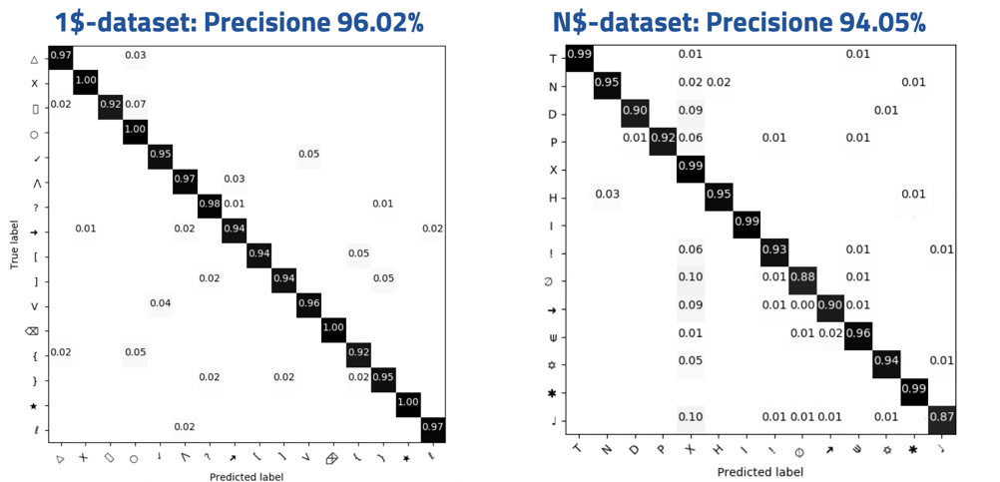
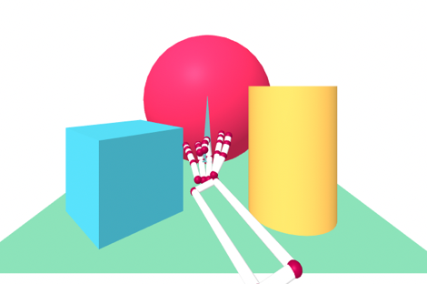
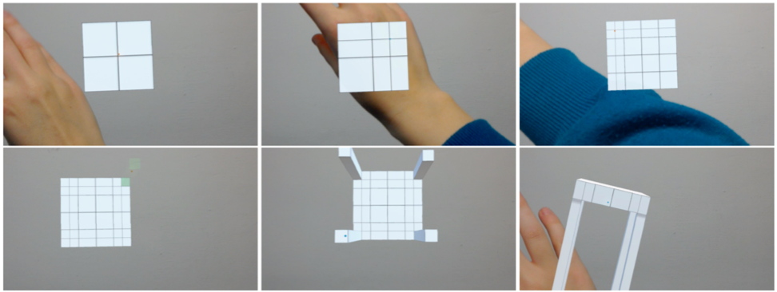
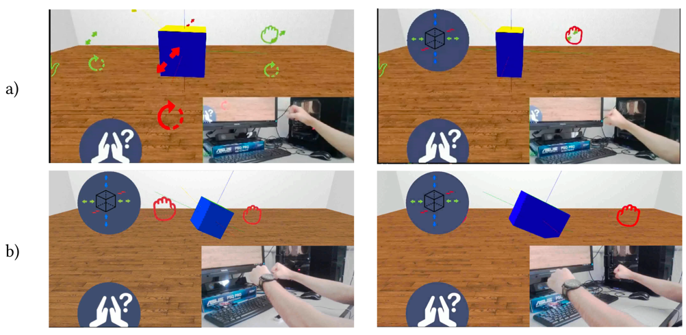

<header>
<h1>D3P2 </h1>
</header>

The main objective of the D3-P2 project is to study a authoring system for immersive digital content,
supporting its creation and editing through web technologies. Through this support, users without
specific knowledge of 3D, virtual reality (VR) or augmented reality (AR) can create presentations that
use advanced interaction devices, now available for the mass market.

The project has been funded by the [Sardinian Regional Government](https://www.regione.sardegna.it/), it started 
in April 2017 and ended in April 2019.

##Outline
1. [Objectives](#obiettivi)
2. [Results](#risultati)
3. [The Research Group](#gruppo)
4. [Demonstration Videos](#video) 
5. [Papers](#pubblicazioni)

## Project Objectives
The entry into the mass market of low-cost hardware allows  operations that in the past were expensive, such as viewing virtual environments in stereoscopy and it opens the way to the use of immersive content on the web. But the history of the web teaches us that users do not only want to be passive consumers of content, but also and above all they like to be creative authors. However, the barrier remains the technical knowledge needed to manipulate new technologies. The main objective of the D3-P2 project is to study an authoring system for immersive digital content, supporting the creation and use through web technologies. Through this support, users not having specific knowledge of 3D, virtual reality (VR) or augmented reality (AR) can create presentations that use advanced interaction devices, now available to the mass market.

From a scientific point of view, the project aimed to solve two open research problems:
* Provide representations of the objects to be included in an immersive scene, the control of the static and interactive properties, simple for being understandable to the end-user but at the same time expressive enough, to guarantee the quality of the content created.
* Provide support for the various devices and their different interactive capabilities, by adapting the presentations to the configuration currently in use by the user. The solution to this problem is a state-of-the-art advancement in the definition of rules for adaptive interfaces, which allow you to reconfigure user input support based on available peripherals, as well as rendering the scene based on the graphic potential of the display support.

The general objectives of the project were the following:
1. Creation of immersive content through a combination of three-dimensional objects and multimedia contents, their manipulation and modification, both in the design mode and in the mode of use of the immersive environment.
2. Definition of the interactive behavior of the objects inserted in the environment, without assuming any knowledge of programming languages ​​by the author.
3. Support for the acquisition and export of objects from the virtual environment to the real one by scanning and 3D printing
4. Adaptation of the presentation to the contents and the methods of interaction to the current devices.

## Results

###Objective 1: Authoring immersive contents
Regarding the support for authoring immersive content, the project focused on the creation of various extensions for the open source library [A-Frame](http://aframe.io), to support the interaction with users without programming experience.
Concerning the design method, we proposed a categorization and labeling of the various properties describing the interactive actions, adapting them to the vocabulary of non-expert users. Finally, we created a web interface for the modification of these properties, through standard WIMP interactors.
The most innovative part in achieving this goal is certainly changing the objects properties in an immersive way. We first focused on how to manipulate interactive objects in the virtual environment through gestures. The first problem dealt with was defining interactive gestures in a language understandable to designers and developers, and providing a robust support for recognition. The result of this research was the definition of DEICTIC, which allows generating precise classifiers starting from the description of a gesture through simple geometric primitives (lines, points or arcs). The method demonstrated an excellent level of expressiveness and a high recognition rate.
In [Figure 1](#figura1) we show the confusion matrix in the recognition of two datasets widely used in literature, modeled with the proposed approach. We also validated the technique with programmers, and it proved easier and faster to use than the traditional event model. 

*Figure 1: results of the recognition of the 1$ dataset (5280 sequences representing 16 gestures) and of the dataset
 N$ (8400 sequences representing 14 gestures) through DEICTIC*

By taking advantage of the support for interactive gestures, it was possible to build the content manipulation environment
interactive in immersive mode, which has the novelty of using web technologies.
In particular, we developed released several plugins for the A-Frame library that allow modifying,
through interactive gestures, the properties of the objects using the VR viewer ([Code](https://github.com/unica-tesi-hci)).
The first plugin allows you to remotely select an object in the scene, bringing it closer to the user to edit
(scaling and / or rotating it) and reposition it to the starting position. The gesture mimics Spider-Man's movements for
launch a spider web (see the representation of the virtual arm in [Figure 2](#figura2)), associated with a metaphor casting
a ray to object. The translation is instead a simple gesture of closing the hand for grasp the object.

*Figure 2: Selection, scaling and rotation from within the virtual environment*

The second plugin instead allows changing the lighting of the scene, placing different lights inside
of the environment, checking its type (environment, spot or directional), color and brightness ([Figure 3](#figura3)).

###Objective 2: Defining the dynamic object behaviour
Also for this objective, we divided the functions according to their complexity. We support the animations, which are
simpler to model and a frequent interactive behavior in virtual scenes, both in design and in immersive mode.
The definition of the animations in immersive mode allows creating of different key poses for the same object.
In addition to adding or removing these poses, the user can select existing ones and specify,
through manipulation, the value of different attributes of the three-dimensional object (position, scaling, rotation,
color etc.). During the execution of the animation, the system interpolates the value of the attributes from the pose of
index *i* towards the values of the pose *i + 1*. [Figure 4](#figura4) shows a sample animation definition.

*Figure 4: definition of an animation in immersive mode. The user can use the handles to modify the current pose. The other poses are displayed in transparency*

The behaviors we can define in design mode are more complex. We used a rules system whose effectiveness is documented in the literature. We use a series of rules of the type Event-Condition-Action, to be shown through a simplified representation in natural language. The rules all have the following syntax:

~~~~
When <subject> <action> [object/value] 
[if condition] 
then <subject> <action> [object/value]
~~~~

Through the *when* part, the user establishes the cause for the action that changes the state of the scene. With the optional part
*if*, instead, s/he established the constraints to take action.
The *then* part determines the action or actions to be performed.

## Objective 3: Acquisition and export of 3D objects
We created a server-side library that allows to acquire three-dimensional scans of objects through Microsoft Kinect. The server includes automatic geometry simplification procedures supporting the display of the result on a browser. In addition, we have developed a three-dimensional modeling tool for augmented reality for Microsoft Hololens, a non-occlusive head mounted display developed by Microsoft. The modeler allows creating shapes that respect the fabrication constraints for 3D printers. The interaction exploits gestures recognized through Leap Motion. The modeler follows the box modeling paradigm, of which it integrates the main functions. Each modification is subject to a validity test which prevents the generation 3D-printable configurations such as self-intersections or areas without volume (two-dimensional).

*Figure 5: Modeling sequence of a table in augmented reality using Microsoft Hololens*

### Objective 4: Interaction Adaptation
We have studied a pattern for developing applications that exploit virtual reality on the web allowing an opportunistic adaptation to the devices available on the system in use. This is a very important feature on the web, where the same content must be adapted to different hardware and software configurations. We generalized the solution applied to our three-dimensional content editor transforming it into a framework that solves several known problems in the field: 1) the management of the scene 3D rendering, 2) the support for various output devices (screens, mobile phones, viewers), and 3) the management of the orientation of the screen and/or HMD, 4) receiving the input  from different devices and computation nodes on the browser, 5) the distribution of different input and output devices, 6) the use of abstract events with respect to the interaction device.
The framework application was validated with a user study, which demonstrated its flexibility reimplementing different metaphors for interacting with objects in virtual reality, using different interaction devices.

*Figure 6: Example of adaptation of the interaction to the device. Upper part (a): scaling of an object
 using multiple handles: the user grabs a mesh and moves it to change the size of the object.
 Lower part (b): scaling of an object using the handlebar metaphor. The user grabs a virtual bar with
 two hands for example along the X axis and increases the distance between the hands to increase the size of the object*

## Research Group
* **Lucio Davide Spano.** Principal Investigator.
* **Fabio Sorrentino.** Research Fellow.
* **Alessandro Carcangiu.** PhD Student.
* **Alessio Murru.** PhD Student.
* **Matteo Serpi.** Master Student.
* **Elisa Pau.** Master Student.
* **Francesca Cella.** Bachelor Student.
* **Roberta Galici.** Bachelor Student.
* **Laura Ordile.** Bachelor Student.
* **Riccardo Balia.** Bachelor Student.

## Demo Videos

###Web5VR

<iframe width="420" height="315" src="https://www.youtube.com/embed/SE8_lN3pS4M"></iframe>

###Selection, manipulation and animations
<iframe width="420" height="315" src="https://www.youtube.com/embed/BdfmoxJNAMc"></iframe>

## Project Publications
* Alessandro Carcangiu, Lucio Davide Spano, Giorgio Fumera, Fabio Roli: DEICTIC: A compositional and declarative gesture description based on hidden markov models. Int. J. Hum.-Comput. Stud. 122: 113-132 (2019)
* Alessandro Carcangiu, Lucio Davide Spano: Integrating declarative models and HMMs for online gesture recognition. IUI Companion, ACM. 2019: 87-88
* Fabio Sorrentino and Lucio Davide Spano. Post-it notes: supporting teachers in authoring vocabulary game contents. Multimed Tools Appl (2019). https://doi.org/10.1007/s11042-019-7604-6
* Fabio Marco Caputo, Pietro Prebianca, Alessandro Carcangiu, Lucio Davide Spano, Andrea Giachetti: Comparing 3D trajectories for simple mid-air gesture recognition. Computers & Graphics 73: 17-25 (2018)
* Matteo Serpi, Alessandro Carcangiu, Alessio Murru, Lucio Davide Spano: Web5VR: A Flexible Framework for Integrating Virtual Reality Input and Output Devices on the Web. PACMHCI 2: 4:1-4:19 (2018)
* Alessandro Carcangiu, Lucio Davide Spano: G-Gene: A Gene Alignment Method for Online Partial Stroke Gestures Recognition. PACMHCI 2: 13:1-13:17 (2018)
* Federico Cau, Alessandro Carcangiu, Fabio Sorrentino, Lucio Davide Spano: SnAIR Drum: A Gesture Interface for Rhythm Practice. DCPD@CHItaly 2017: 116-119
* Martina Senis, Giovanni Atzori, Fabio Sorrentino, Lucio Davide Spano, Gianni Fenu: Smart Furniture and Technologies for Supporting Distributed Learning Groups. CHItaly 2017: 11:1-11:6
* Fabio Marco Caputo, Pietro Prebianca, Alessandro Carcangiu, Lucio Davide Spano, Andrea Giachetti: A 3 Cent Recognizer: Simple and Effective Retrieval and Classification of Mid-air Gestures from Single 3D Traces. Eurographics Italian Chapter Conference 2017: 9-15
* Alessandro Carcangiu, Lucio Davide Spano, Giorgio Fumera, Fabio Roli: Gesture Modelling and Recognition by Integrating Declarative Models and Pattern Recognition Algorithms. ICIAP (1) 2017: 84-95
