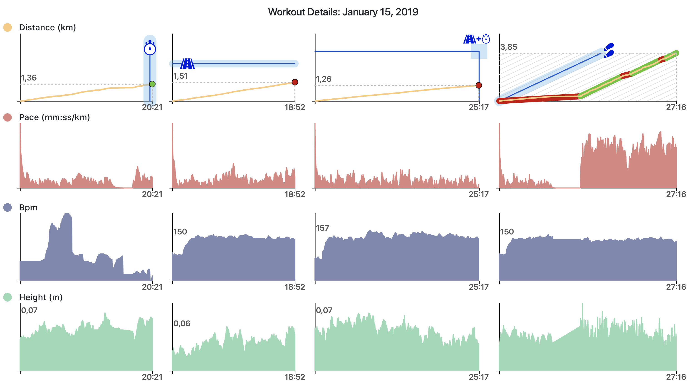
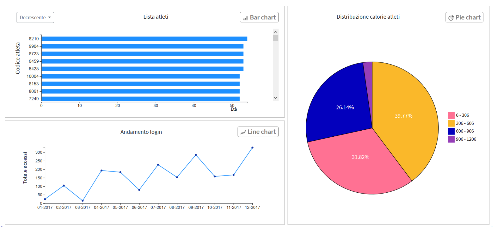

<header>
<h1>AI4FIT </h1>

Artificial Intelligence & Human Computer Interaction per l’e-coaching

</header>

L'obiettivo principale del progetto è quello di incrementare le funzionalità correnti della piattaforma [u4fit](https://www.u4fit.com/) inserendo funzionalità di intelligenza artificiale, che siano ispezionabili e controllabili dai diversi utenti della piattaforma. 

Il progetto è stato finanziato da [Sardegna Ricerche](https://www.regione.sardegna.it/) è iniziato nel
2017 e finirà nel 2020. 

##Sommario
1. [Obiettivi](#obiettivi)
2. [Risultati](#risultati)
3. [Il Gruppo di Ricerca](#gruppo)
4. [Pubblicazioni](#pubblicazioni)

## Obiettivi
u4Fit è una app per runners di tutti i livelli, che cerca di rispondere con la tecnologia alla problematica degli allenamenti fai-da-te che hanno come conseguenza l’essere poco costanti
a causa di una motivazione altalenante, rischi per la salute, dovuti ad errati protocolli di allenamento. u4fit risolve questi problemi offrendo la possibilità di essere seguiti e supervisionati
da remoto da un allenatore reale, scegliendolo tra tanti disponibili in un libero marketplace. Inoltre mette a disposizione di entrambi (allenatori e sportivi), strumenti all’avanguardia per supportarli nelle rispettive attività: piattaforma di lavoro per i trainer e strumenti per l’allenamento per gli sportivi.

Durante il progetto, l'obiettivo è quello di inserire algoritmi di intelligenza artificiale per fornire agli allenatori e atleti avanzati strumenti di lavoro intelligenti, che intervengano in tutti i processi che riguardano la relazione trainer-cliente. Nello specifico, utilizzando l’intelligenza artificiale per l’analisi dei dati di fitness (per esempio dei risultati degli allenamenti), col fine di fornire in automatico al trainer quante più informazioni possibili per permettergli di prendere le decisioni e dare i corretti feedback ai clienti.

## Risultati

###Visualizzazione dei dati per gli allenatori
Abbiamo creato un'interfaccia che combina gli algoritmi di classificazione automatica e i consigli di un esperto umano per fornire feedback remoto ai corridori. Il supporto intelligente propone una valutazione per ogni allenamento registrato utilizzando tecniche di apprendimento automatico, mentre l'interfaccia rappresenta esplicitamente la fiducia nella classificazione e i limiti per aumentare e ridurre la valutazione per ciascuna caratteristica considerata. L'obiettivo è fornire un feedback di alta qualità a un gran numero di atleti, focalizzando l'attenzione dell'allenatore su quegli allenamenti che richiedono l'analisi di un esperto, supportando sia l'ispezione che il controllo della classificazione proposta dalla macchina. Abbiamo valutato l'interfaccia per l'ispezione con allenatori reali dimostrando la sua utilità e efficacia nel compito previsto.

*Figura 1: Visualizzazione di un allenamento di esempio composto da quattro segmenti con obiettivi diversi (tempo, distanza, tempo e distanza, ritmo). Contiene quattro diversi grafici allineati nel tempo sull'asse x, uno per ciascuna metrica tracciata: distanza, andatura, battiti cardiaci per minuti e altitudine (altezza). Gli spazi bianchi sull'asse x corrispondono ai tempi di riposo tra due segmenti di allenamento.*

### Ispezione dei dati in linguaggio naturale
Abbiamo creato una semplice architettura di supporto durante l'ispezione di un set di dati generico utilizzando query in linguaggio naturale. Mostriamo come integrare le moderne librerie di Intelligenza Artificiale nel
sistema e come derivare la visualizzazione del grafico dall'intenzione dell'utente.  Abbiamo valutato l'interfaccia con utenti, mostrando un buon risultato accettazione ed efficacia dell'approccio proposto.

*Figura 2: Risultato della query "Mostrami la durata degli allenamenti degli atleti tra i 20 e i 55 anni, raggruppati per calorie e con il loro trend di accesso per mese*

## Gruppo di Ricerca
* **Lucio Davide Spano.** Responsabile scientifico.
* **Federico Maria Cau.** Borsista di ricerca.
* **Mattia Samuel Mancosu.** Borsista di ricerca.
* **Alessandro Carcangiu.** Borsista di ricerca.

##  Pubblicazioni
* Francesca Bacci, Federico Maria Cau, Lucio Davide Spano: Inspecting Data Using Natural Language Queries. Proceedings of ICCSA 2020. 
* Federico Maria Cau, Mattia Samuel Mancosu, Fabrizio Mulas, Paolo Pilloni, Lucio Davide Spano: An intelligent interface for supporting coaches in providing running feedback. CHItaly 2019: 6:1-6:5
* Federico Maria Cau, Mattia Samuel Mancosu, Fabrizio Mulas, Paolo Pilloni, Lucio Davide Spano: An interface for explaining the automatic classification of runners' trainings. IUI Companion 2019: 41-42

